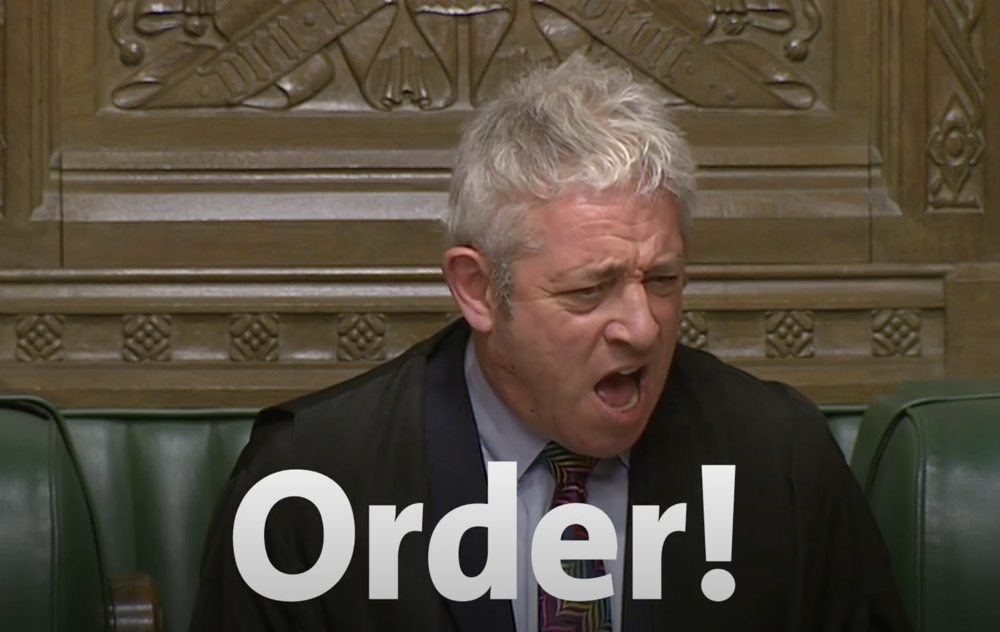

We see the terms **order(阶)** and **rank(秩)** in many places around PL and CS. It's a good idea to have a quick review of them. This post doesn't cover the usage of order for comparision, such as total order, partial order, etc. It is worth mentioning that in this case it's translated as 序 in Chinese.

**Order**, appeared in first-order, second-order, and higher-order, is used to in terms like first-order logic, higher-order functions. Very briefly, first-order logic is a logic with symbols `x`, predicates `P`, and else. The predicate can only be applied on symbols e.g. `Is_positive(x)` or `Greater(x, y)`. Second-order logic extends the first-order logic by allowing predicates over symbols (called first-order predicate) and predicates over first-order predicate (called first-order predicate), e.g. `(P(x,y) && P(y,z) => P(x,z)) == Transitive(P,x,y,z)`. It's more interesting to talk about logic with quantifiers `forall(∀), exists(∃)`. For example, in second-order quantifier logic, we can say _Induction Axiom_ as `∀P.((P(0) && ∀n.(P(n) => P(n+1))) => ∀n.P(n))`. It reads: for every predicate on natural numbers, if the predicate holds for 0 and for every number `n`, if the predicate holds for `n`, then the predicate holds for `n+1`, then the predicate holds for every number. [SEP][SEP:Second-order and Higher-order Logic]. The logic's order is the possible nested level for predicate: first-order for predicate over symbols, second-order for predicate over first-order predicate, and so on.

**Order** for functional programming is the possible nested level for functions. Say the basic domain is integer. The first-order functions range from integers to integers. Second-order functions range from or to integers and first-order functions. Higher-order functions allow arbitrary nesting of functions. Functions are more subtle than logic formulas because they can support multiple arguments or they can be curried.

Aside, there is some bluring between _first-class functions_ and _higher-order functions_. My observation is _first-class functions_ emphasize the function as an expression to program, while _higher-order functions_ emphasize what are passed in and returned from and to functions.

Rank polymorphism 

<!-- **Rank**, used in parametric polymorphism, means the possible nested level for _forall_ types. For example, `id : forall a. a -> a` is a rank-1 polymorphism, while `check_id : (forall a. a -> a) -> bool` is a rank-2 polymorphism. It's a written convenrtion to use _rank-2_ instead of _second-rank_ in this topic. -->

**Order** and **rank** are also used in mathematics. It will be interesting to also view them in the future and to see if any connections between them _historically_ and _conceptually_.

<!-- I admit that I am not that clear here for second-order functions and let me leave them for future editing. One question is second-order functions obviously take first-order functions as arguments, can they return a first-order function? Does `fun f -> fun x -> (f x) + 1` counts?  -->

[SEP:Second-order and Higher-order Logic]: https://plato.stanford.edu/entries/logic-higher-order/]